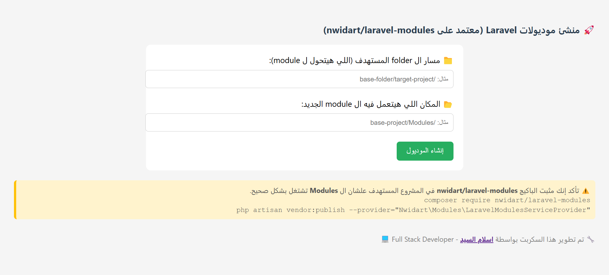

# 🚀 Laravel Module Structure

🛠️ أداة لتحويل مجلد إلى وحدة Laravel متكاملة.

>  💡 إذا أعجبك المشروع، لا تنسَ تعمل ⭐ Star!

> ⚠️ **تنبيه هام جدًا**
>
> يُفضل تجربة المشروع أولاً على مجلد تجريبي قبل استخدامه على مشروع فعلي.  
> السكريبت يقوم بنقل وتعديل الملفات تلقائيًا، وقد يؤدي استخدامه بشكل مباشر على ملفات الإنتاج إلى فقدان بيانات أو تلف هيكل المشروع.  
> **استخدمه على مسؤوليتك الخاصة، والمطور غير مسؤول عن أي ضرر قد يحدث.**

---

## ➖ 📦 ما الذي يقدمه هذا المشروع؟

- تحويل مجلد عشوائي إلى **وحدة Module قابلة للتكامل مع Laravel**.
- عرض **هيكل الملفات والمجلدات بشكل مرئي** بأيقونات 📁 و 📄.
- واجهة استخدام سهلة تعتمد على **نموذج إدخال (Form)**.
- لا يتطلب أي إعدادات معقدة — فقط ارفع المشروع وابدأ.

---

يعرض السكريبت هيكل المجلدات بشكل متداخل بعمق يصل إلى 10 مستويات (يمكن تعديله داخل الكود إذا رغبت، لكن ليس مطلوبًا).

---

## ➖ 🖼️ لقطة من الواجهة

---

## ➖ ✅ المتطلبات

- خادم ويب يدعم PHP (مثل Apache أو Nginx مع PHP).
- صلاحيات كتابة على المجلد الوجهة `Modules/`.
- PHP 7.0 أو أحدث.

---

## ➖ 🚀 كيفية الاستخدام

### 1. رفع المشروع

- افتح الصفحة في المتصفح عبر الرابط:  
   [http://localhost/laravel-module-structure](http://localhost/laravel-module-structure)
- ستجد نموذج يحتوي على:
  - **حقل للمجلد المستهدف**: المسار الكامل للمجلد الذي تريد تحويل لوحدة (مثلاً: `C:/Users/YourName/Desktop/demo`).
  - **حقل للمكان الجديد**: المكان الذي سيتم انشاء الوحدة الجديدة بداخله ويفضل ينتهي ب `Modules/`.

---

## ➖ ⚙️ **ماذا يحدث بعد الضغط على "نقل الملفات"؟**

### عند الضغط على زر "نقل الملفات"، يقوم السكريبت تلقائيًا بتنفيذ الخطوات التالية:

### ➖ بشكل عام

1. 📁 **إنشاء وحدة جديدة داخل `Modules/`**
2. 🔄 **إعادة ترتيب المجلدات والملفات داخليًا**
3. 🧠 **تعديل الكود البرمجي تلقائيًا داخل الملفات**
4. 🧾 **توليد ملفات تعريف الوحدة**
5. 📂 **عرض هيكل الوحدة بعد النقل**

### ➖ بشكل تفصيلي

🔵📁 1. إنشاء وحدة جديدة داخل `Modules/`

- **اسم الوحدة الجديد**: سيتم استخدام اسم المجلد الذي قمت بإدخاله في النموذج والذي سيتم تحويله الي وحدة داخل ال `Modules/`.
- يُنسخ المحتوى الكامل للمجلد المصدر إلى هذا المجلد.

🔵🔄 2. إعادة ترتيب المجلدات والملفات داخليًا (بنية الوحدة)

- يتم نقل كل ملف إلى مجلد فرعي مناسب (مثل Http/Controllers, Entities, Database/Migrations, Resources/views, إلخ) وفقًا لطبيعة الملف واسمه.

🔵🧠 3. تعديل الكود البرمجي تلقائيًا داخل الملفات المنقولة:

- ✅ السكريبت يقوم بالتعديلات التالية على محتوى الملفات:
  - مثل ال namespace ➤ يتم تعديله ليتماشى مع هيكل Laravel للوحدات (مثلاً: Modules\BlogModule\Http\Controllers بدلاً من App\Http\Controllers).
  - و `...\use App\Models` ➤ يتم تعديله إلى:   `...\use Modules\ModuleName\Entities` بشكل تلقائي حسب موقع الملف الجديد.
  - أي استخدام مباشر لـ `...\App\Models\` ➤ يتم تعديله كذلك إلى `...\Modules\ModuleName\Entities\`
  - أسماء الكلاسات في بعض الملفات ➤ يتم تحديثها لتتوافق مع اسم الوحدة الجديد (مثلاً: BlogController فيُصبح OrderController).
  - تحديث جميع المسارات داخل الملفات (مثل include أو require أو use) لتتطابق مع مواقع الملفات الجديدة بعد النقل.

🔵🧾 4. توليد ملفات تعريف الوحدة

- ✅ السكريبت يقوم بإنشاء ملفات أساسية لوحدة Laravel مثل:
  - ملف module.json: يحتوي على بيانات الوحدة مثل الاسم، الوصف، الحالة.
  - ملف ModuleServiceProvider.php: مزود الخدمة الخاص بالوحدة.
  - ملف RouteServiceProvider.php: لتسجيل مسارات web.php و api.php.

🔵📂 5. عرض هيكل الوحدة بعد النقل
- يتم عرض الهيكل الكامل للمجلد الجديد داخل Modules/ باستخدام رموز توضيحية:
  - 📁 مجلدات
  - 📄 ملفات
- العرض يتم بشكل هرمي (Tree View) بعمق يصل إلى 10 مستويات او علي حسب احتياجك.

---

## ➖ 📂 شكل العرض بعد النقل

بعد نجاح العملية، سيتم عرض هيكل المجلد باستخدام رموز توضيحية:

- 📁 مجلد
- 📄 ملف

#### ✨ مثال توضيحي

### ⛔ قبل التحويل

#### (قائمة الملفات العشوائية قبل التحويل...)

- 📄 2024_03_01_175602_create_order_items_table.php
- 📄 2024_03_01_175702_create_orders_table.php
- 📄 2024_03_01_175902_create_invoices_table.php
- 📄 GeneralRepository.php
- 📄 GeneralServices.php
- 📄 Invoice.php
- 📄 InvoiceController.php
- 📄 Kernel.php
- 📄 LoginRequestcls.php
- 📄 Order.php
- 📄 OrderController.php
- 📄 OrderItem.php
- 📄 OrderItemController.php
- 📄 OrderStatusNotification.php
- 📄 Orders_Module.zip
- 📄 ReservationFailed.php
- 📄 ReservationReminder.php
- 📄 SendMessage.php
- 📄 SessionExpired.php
- 📄 SetLocale.php
- 📄 addOrder.css
- 📄 image.png
- 📄 image2.jpg
- 📄 image3.png
- 📄 image4.webp
- 📄 invoice.css
- 📁 invoices/
  - 📄 index.blade.php
  - 📄 read.blade.php
- 📁 orders/
  - 📄 add.blade.php
  - 📄 index.blade.php
  - 📄 show.blade.php
- 📁 products/
  - 📄 add.blade.php
  - 📄 index.blade.php
  - 📄 show.blade.php

### ✅ بعد التحويل

#### (هيكل الوحدة بعد التنظيم...)

- 📁 Database
  - 📁 Migratio
    - 📄 2024_03_01_175602_create_order_items_table.php
    - 📄 2024_03_01_175702_create_orders_table.php
    - 📄 2024_03_01_175902_create_invoices_table.php
- 📁 Entities
  - 📄 Invoice.php
  - 📄 Order.php
  - 📄 OrderItem.php
- 📁 Events
  - 📄 SendMessage.php
- 📁 Http
  - 📁 Controllers
    - 📄 InvoiceController.php
    - 📄 OrderController.php
    - 📄 OrderItemController.php
  - 📁 Middleware
    - 📄 Kernel.php
    - 📄 SessionExpired.php
    - 📄 SetLocale.php
  - 📁 Requests
    - 📄 LoginRequestcls.php
- 📁 Mail
  - 📄 ReservationFailed.php
  - 📄 ReservationReminder.php
- 📁 Notifications
  - 📄 OrderStatusNotification.php
- 📁 Other
  - 📄 Orders_Module.zip
- 📁 Repositories
  - 📄 GeneralRepository.php
- 📁 Resources
  - 📁 assets
    - 📁 css
      - 📄 addOrder.css
      - 📄 invoice.css
    - 📁 images
      - 📄 image.png
      - 📄 image2.jpg
      - 📄 image3.png
      - 📄 image4.webp
  - 📁 views
    - 📁 invoices
      - 📄 index.blade.php
      - 📄 read.blade.php
    - 📁 orders
      - 📄 add.blade.php
      - 📄 index.blade.php
      - 📄 show.blade.php
    - 📁 products
      - 📄 add.blade.php
      - 📄 index.blade.php
      - 📄 show.blade.php
- 📁 Providers
  - 📄 ModuleNameServiceProvider.php
  - 📄 RouteServiceProvider.php
- 📁 Services
  - 📄 GeneralServices.php
- 📁 Routes
  - 📄 api.php
  - 📄 web.php
- 📁 Tests
  - 📁 Feature
  - 📁 Unit
- composer.json
- module.json
- package.json
- vite.config.js

---

## ➖ 🧠 ملاحظات مهمة

- ✅ لا تحتاج إلى تعديل أي سطر في الكود — كل شيء يتم من خلال النموذج فقط.
- تأكد من صلاحيات الوصول للمجلدات والملفات.
- يتم **الكتابة فوق الملفات** إذا كانت موجودة مسبقًا بنفس الاسم داخل الوجهة.
- السكريبت لا يدعم التعامل مع الملفات الكبيرة جدًا أو التي تحتوي على مشاكل صلاحيات معقدة.

---

## ➖ 🛠️ المساهمة في المشروع

هل لديك أفكار أو تحسينات؟ نرحب بمساهماتك!

- افتح Issue.
- أو قدم Pull Request.

---
## ❤️ الدعم

إذا استفدت من هذا المشروع، من فضلك:

-  اعمل ⭐ Star للمستودع
- شاركه مع من تعتقد أنه سيستفيد
- أو تابعني على GitHub لمزيد من المشاريع

شكرًا لك! ☺️❤️

---

## ➖ 📬 تواصل معي

- 📧 **الإيميل**: [eslamalsayed8133@gmail.com](mailto:eslamalsayed8133@gmail.com)
- 💼 **لينكدإن**: [IslamAlsayed](https://www.linkedin.com/in/islam-alsayed7)
- 💼 **فيسبوك**: [IslamAlsayed](https://www.facebook.com/islamalsayed00)

---

> ✨ تم تطوير هذا المشروع لتسهيل تحويل أي مجلد إلى وحدة برمجية منظمة بنقرة واحدة.
